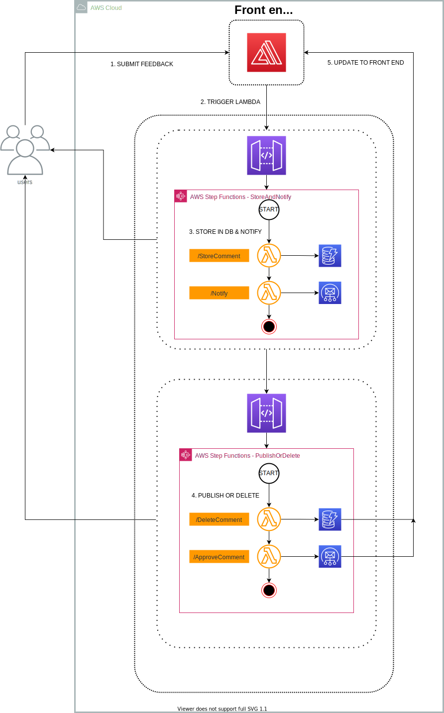

# ServerlessPublicFeedbackApp
Public facing feedback submission solution 3 tier application: Presentation, business logic, storage. Which tech would you use for each stack, including programming language Using only serverless technologies. In AWS.

This repo aims to provide documentation on the Serverless Feedback Application. The application receives feedback in the form of comments via a front end hosted on React, which is then submitted into DynamoDB and a notification is triggered to the admin. The admin has the option to either approve or delete the comment. The OP is then notified of the status of the comment.

## Architecture

### High-level architecture
This is a high-level view of the application depicting both frontend and backend with the interconnection between the various AWS services used.

  

### Services and Technologies used
**Frontend App Hosting**:
- [AWS Amplify](https://aws.amazon.com/amplify/) for hosting the frontend React JS application. Amplify provides the storage and global content distribtion together with a CI/CD pipeline to deploy new changes to the frontend.

**API Hosting**:
- [Amazon API Gateway](https://aws.amazon.com/api-gateway/) for service-to-service synchronous communication (request/response).

**Compute**:
- [AWS Lambda](https://aws.amazon.com/lambda/) as serverless compute either behind APIs or to react to asynchronous events.

**Microservice Orchestration**:

- [AWS Step Functions](https://aws.amazon.com/step-functions/) used to orchestrate the serverless function that makes it easy to sequence AWS Lambda functions and multiple AWS services into business-critical applications.

**Storage**:

- [Amazon DynamoDB](https://aws.amazon.com/dynamodb/) as a scalable NoSQL database for persisting informations.

**Notification**:
- [Amazon SES](https://aws.amazon.com/ses/) as a simple, managed email service.

Please see the [frontend](https://github.com/sourav-bhattacharya/ServerlessPublicFeedback/blob/main/docs/frontend.md) and [backend](https://github.com/sourav-bhattacharya/ServerlessPublicFeedback/blob/main/docs/backend.md) docs section to get a deeper understanding of the solution.
